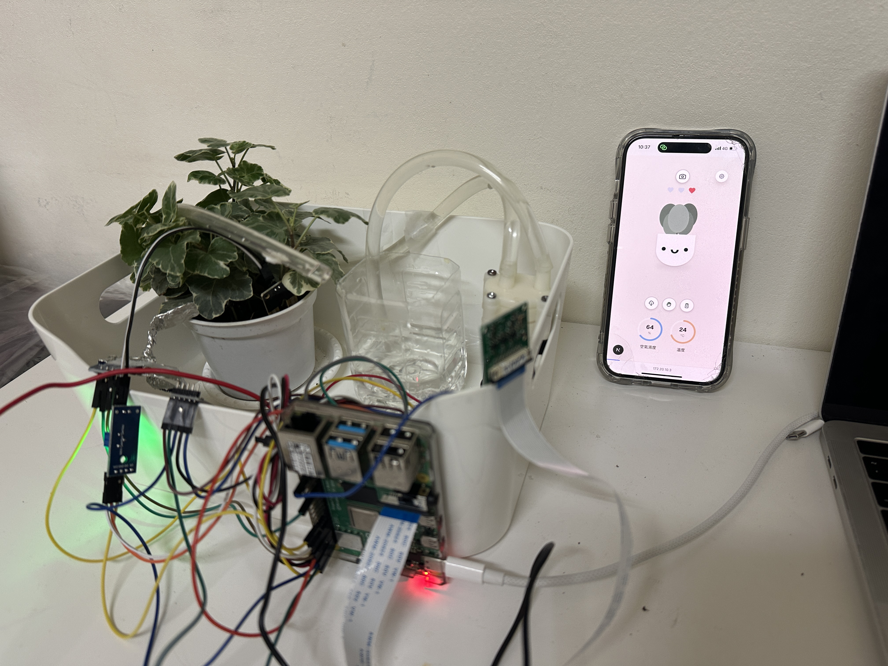
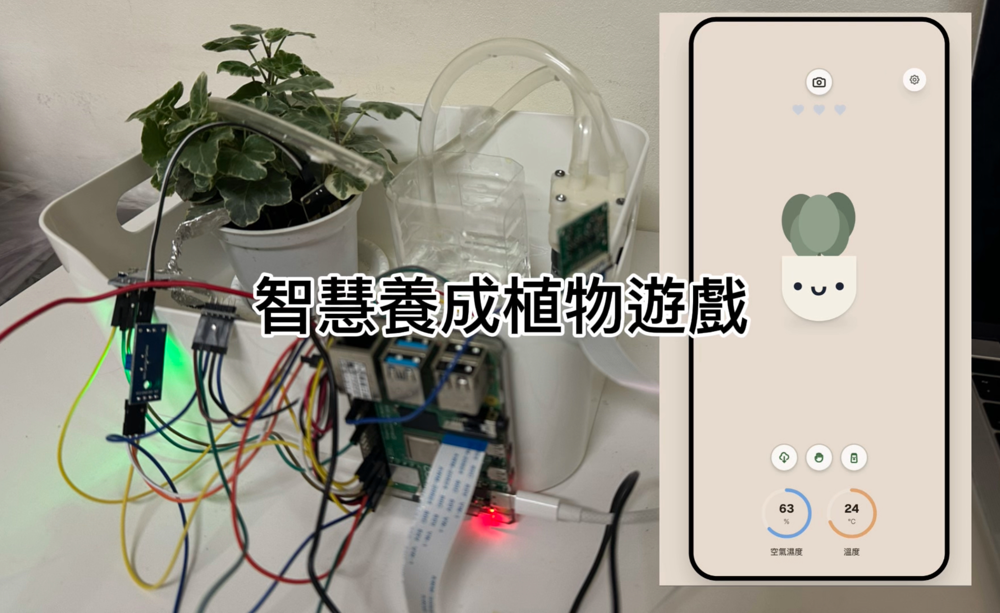

# 智慧植物照護系統 SmartPlant game
Iot final project

---

## 目錄
1. [專案介紹](#專案介紹)
2. [系統架構](#系統架構)
3. [硬體設備與接線說明](#硬體設備與接線說明)
4. [系統功能說明](#系統功能說明)
5. [軟體環境](#軟體環境)
6. [檔案結構說明](#檔案結構說明)
7. [安裝與執行方式](#安裝與執行方式)
8. [測試方式](#測試方式)
9. [未來改進方向](#未來改進方向)

---

## 專案介紹
本專案為一套以 Raspberry Pi 為核心的智慧植物照護系統，
透過多種感測器即時蒐集植物生長環境數據，
並結合自動澆水互動式回饋機制。目的是可以類似複製一個植物的虛擬分身到遊戲裡，讓他在遊戲中回饋在現實中無法達到的互動及情緒價值。
本系統主要應用於：
- 初學者植物照護
- 中小學自然科科教育互動
- 遠距照顧植物者
- IoT 與嵌入式系統學習

---
**裝置圖片：**

<p align="center">
  
</p>


---

**demo影片：**
<p align="center">
  <a href="https://youtu.be/a2GsV1feKWs">
    
  </a>
</p>


---

## 系統架構
```text
[ Browser (Next.js) ]
        |
        | HTTP (REST API)
        v
[ Flask Backend (Raspberry Pi) ]
        |
        |-- Sensors (GPIO / I2C)
        |-- Relay Control
        |-- Camera (libcamera)
        v
[ Physical World ]
        |-- Plant
        |-- Soil
        |-- Water Pump
```
---

## 硬體設備與接線說明
本系統使用之主要硬體設備如下：

- Raspberry Pi 4
- 溫溼度感測器 DHT22
- 土壤濕度感測器 Soil Moisture Sensor (DO)
- 光照感測器 BH1750
- 觸控感測器 TTP223
- 繼電器模組 FL-3FF-S-Z
- 水泵 12V pump
- 攝影機模組 Raspberry Pi Camera

各感測器皆透過 GPIO 腳位與 Raspberry Pi 連接，
電源統一由 3.3V 或 5V 提供，並共用GND。

**線路圖：**


**接線表：**
| 功能 | 元件 | GPIO 腳位（BCM） | 實體腳位（J8） | 電源 | GND | 備註 |
|---|---|---|---|---|---|---|
| 溫溼度感測 | DHT22 | GPIO4 | Pin 7 | 3.3V | GND | 單線通訊，需上拉電阻 |
| 土壤濕度感測 | Soil Moisture Sensor（DO） | GPIO17 | Pin 11 | 3.3V | GND | 數位輸出，高/低代表乾濕 |
| 光照感測 | BH1750 | GPIO2 (SDA) / GPIO3 (SCL) | Pin 3 / 5 | 3.3V | GND | I2C 裝置 |
| 觸控感測 | TTP223 | GPIO22 | Pin 15 | 3.3V | GND | 觸碰輸出 HIGH |
| 繼電器控制 | Relay 模組（FL-3FF-S-Z） | GPIO27 | Pin 13 | 5V | GND | Active-Low 觸發 |
| 水幫浦 | 12V DC Pump | 由 Relay 控制 | - | 外接 12V | 共地 | 不可直接接 GPIO |
| 攝影機 | Raspberry Pi Camera | CSI 介面 | 排線 | 3.3V | - | 非 GPIO，使用 CSI |


---

## 系統功能說明
系統主要功能包括：
- 即時感測
  - 溫度 / 空氣濕度（DHT11）
  - 土壤濕度（Soil Moisture Sensor）
  - 光照強度（BH1750 I2C）
  - 觸控互動（Touch Sensor）

- 實體澆水控制
  - Web 按鈕 → Raspberry Pi → Relay → 12V 水幫浦
  - 具備每日澆水上限與冷卻時間（Cooldown）
  - 互動式前端介面

- 植物情緒狀態（口渴 / 開心 / 滿足 / 興奮）
  - 澆水動畫、觸控加分、滿意度系統
  - Web UI 與實體感測同步

- 相機拍照功能
  - Raspberry Pi Camera Module
  - 從前端觸發拍照並顯示照片

- API Key 保護
  - 澆水 / 拍照 API 需驗證金鑰


---
## 軟體環境
Backend（Raspberry Pi）
- Python 3.11+
- Flask
- RPi.GPIO
- libcamera
- Flask-CORS
- python-dotenv

Frontend
- Next.js (App Router)
- React
- TypeScript
- Tailwind CSS

---

## 檔案結構說明
```text
smartplant/
├── backend/
│   ├── app.py
│   ├── sensors.py
│   ├── pump.py
│   ├── camera.py
│   └── .env
│
├── frontend/
│   ├── app/
│   │   └── page.tsx
│   ├── components/
│   └── public/
│
└── README.md
```
環境變數設定：
```text
MOCK_SENSORS=0
PUMP_MOCK=0

WATER_API_KEY=Wp9fK3zR7mQ2xB8tL4vH1nC6yD0

PUMP_PIN=27
DHT_PIN=4

DAILY_LIMIT_SEC=30
COOLDOWN_SEC=60
```
---

## 安裝與執行方式
```text
Backend（Raspberry Pi）
cd backend
python -m venv .venv
source .venv/bin/activate
pip install -r requirements.txt
python app.py
```
Frontend
```text
cd frontend
npm install
npm run dev
```
---
## 測試方式
1. 測試api
- 查看感測狀態
   ```text
   curl http://<PI_IP>:8000/status
   ```
- 觸發澆水
   ```text
   curl -X POST http://<PI_IP>:8000/water \
   -H "x-api-key: YOUR_KEY" \
   -d "sec=2"
   ```
- 拍照
  ```text
  curl -X POST http://<PI_IP>:8000/camera/capture \
  -H "x-api-key: YOUR_KEY"
  ```
2. 測試檔用途

| 檔名 | 功能說明 | 測試內容 | 備註 |
|------|------|------|------|
| `test_dht22.py` | 測試 DHT22 溫溼度感測器 | 讀取空氣溫度（°C）與濕度（%），確認感測器供電與資料傳輸正常 | 偶爾出現 checksum error 屬正常現象 |
| `test_pump.py` | 測試水幫浦 / 繼電器控制流程 | GPIO 設為 OUTPUT 啟動幫浦，維持短時間後釋放為 INPUT | 確認幫浦不會上電即持續運轉 |
| `test_relay.py` | 測試繼電器 HIGH / LOW 切換 | 手動切換 GPIO HIGH / LOW，觀察繼電器吸合與釋放 | 可聽到繼電器「喀」聲 |
| `test_soil_do.py` | 測試土壤濕度感測器（DO） | 讀取 DO 腳位，高低電位代表乾燥 / 潮濕狀態 | 使用 DO 腳位，不需 ADC |

   
---
## 未來改進方向
1. 我使用的土壤濕度計是DO數位輸出，這樣只能感測到乾與濕的切換。可以加上ADC換成AO類比輸出，可以測量土壤濕度的百分比進而用來透過程式調整不同植物喜好土壤濕度
2. 我使用的relay無法透過程式調整LOW/HIGH，最後是透過調整GPIO IN/OUT解決的。建議可能可以買好一點的繼電器模組。
3. 可嘗試結合 Raspberry Pi Camera 所拍攝的影像，
- 利用影像辨識判斷葉片顏色或枯萎狀態
- 結合感測器資料進行植物健康評估

---
## 參考資料
1. Raspberry Pi Powered IoT Garden. Instructables, 2024.
https://www.instructables.com/Raspberry-Pi-Powered-IOT-Garden/
2. Building Smarter Farming Irrigation with Raspberry Pi and IoT. Raspberry Pi Foundation, 2023.
https://www.raspberrypi.com/news/building-smarter-farming-irrigation-with-raspberry-pi-and-iot/
3. The Application of Touch Sensor. YouTube Video, ID: wPbU09bvwr0.
https://www.youtube.com/watch?v=wPbU09bvwr0


